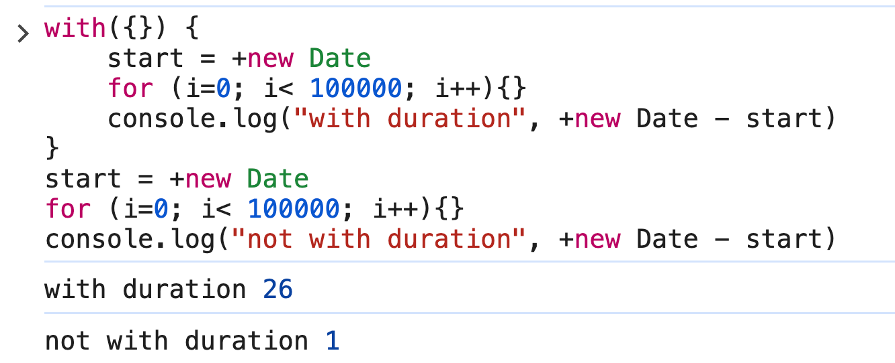

# vite-mfe-federation 🚀

[中文](#zh) | [English](#en)

<a id="en"></a>

## English

A lightweight micro-frontend solution built with mainstream 2026 technologies, delivering high loading performance and complete MF capabilities.

### Related Technologies
- **Micro-frontend: [module-federation](https://module-federation.io)** (mainstream MF modular tech in 2026 with active ecosystem)
- **Micro-router: [single-spa](https://github.com/single-spa/single-spa)** (enterprise-grade MF routing management)
- **Sandbox: [vite-plugin-sandbox](https://github.com/zhangHongEn/vite-plugin-sandbox)** (isolation)
- **Server: Edge Route** (micro-frontend route management, roadmap)

### Features
- High performance: manifest preloading and optimized ESM waterfall to speed up MF loading
- Great DX: HMR, debugging, and module graph support
- Robust sandbox isolation: prevents cross-app pollution (forks from qiankun, battle-tested)

### Comparison
- Performance: Lighthouse score 100
- Sandbox: solutions like [qiankun](https://github.com/umijs/qiankun) and [micro-app](https://github.com/jd-opensource/micro-app) are not vite-esm compatible; using runtime `with` can degrade JS execution by ~20x
  - 

### 🌐 Online Demo
- 🔗 Host demo: [Live Demo](https://zhanghongen.github.io/vite-mfe-federation/vite-vue-app/home/)
- 
- 

### 🧩 Single Module Development Guide
- If you only want to start a single sub-module for development and debugging:
  1. `git clone https://github.com/zhangHongEn/vite-mfe-federation.git`
  2. `pnpm install && pnpm run dev`
  3. Open Chrome extension `module-federation`
  4. `vite-vue-app` proxy to `http://localhost:5001/mf-manifest.json`
  5. `rspack-react-app` proxy to `http://localhost:5002/mf-manifest.json`

### Add a New Application
- In `mfe.json`, add:
```json
{
  "apps": [
    {
      "appCode": "vite-vue-app",
      "routes": ["/vite-mfe-federation/new-app"],
      "entry": "http://localhost:5003/mf-manifest.json"
    }
  ]
}
```


<a id="zh"></a>

## 简体中文

一个使用 2026 年主流技术的轻量化微前端解决方案，拥有极高的加载性能和完整的微前端特性。

### 相关技术领域
- **微前端: [module-federation](https://module-federation.io)**（2026 年最主流的微前端模块化技术，生态活跃）
- **micro-router: [single-spa](https://github.com/single-spa/single-spa)**（大型微前端路由管理方案）
- **sandbox: [vite-plugin-sandbox](https://github.com/zhangHongEn/vite-plugin-sandbox)**（沙箱隔离）
- **server: Edge Route**（微前端路由管理方案，roadmap）

### 特性
- 性能高：manifest 预加载、优化 ESM 加载瀑布，显著提升微前端加载速度
- 开发体验强：支持 HMR、Debug、Module Graph 等能力
- 完善的沙箱隔离：避免应用间相互污染（forks from qiankun，经过大量项目验证）

### 方案对比
- 性能：Lighthouse 100 分
- sandbox：如 [qiankun](https://github.com/umijs/qiankun)、[micro-app](https://github.com/jd-opensource/micro-app) 等一系列方案未兼容 vite-esm，运行时使用 with 会导致 JS 运行效率降低约 20 倍
  - 

### 🌐 在线体验
- 🔗 主应用演示： [Live Demo](https://zhanghongen.github.io/vite-mfe-federation/vite-vue-app/home/)
- 
- 

### 🧩 单模块开发指南
- 仅启动单个子模块进行开发与调试：
  1. `git clone https://github.com/zhangHongEn/vite-mfe-federation.git`
  2. `pnpm install && pnpm run dev`
  3. 打开 Chrome 插件 `module-federation`
  4. `vite-vue-app` 代理：`http://localhost:5001/mf-manifest.json`
  5. `rspack-react-app` 代理：`http://localhost:5002/mf-manifest.json`

### 新增应用
- 在 `mfe.json` 中添加：
```json
{
  "apps": [
    {
      "appCode": "vite-vue-app",
      "routes": ["/vite-mfe-federation/new-app"],
      "entry": "http://localhost:5003/mf-manifest.json"
    }
  ]
}
```
